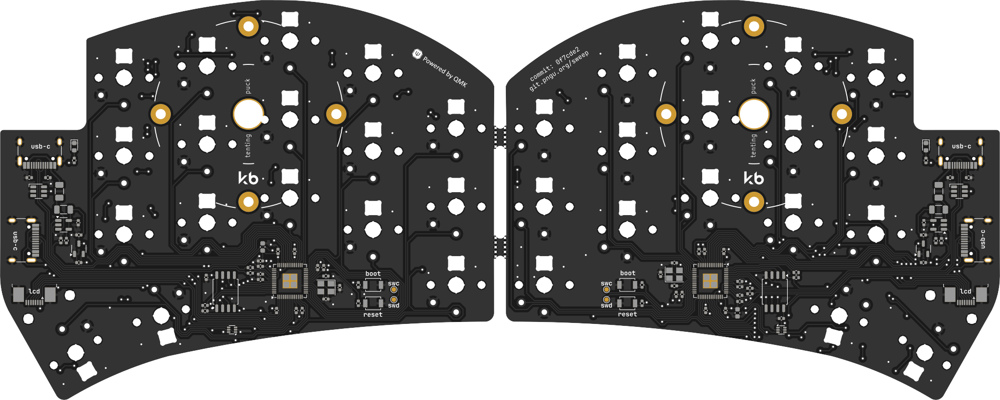

# Sweep

A [Ferris Sweep](https://github.com/davidphilipbarr/Sweep) variant designed with an integrated RP2040 and some other added features.

## Comments & Modifications
This PCB has the exact same dimensions and mounting points (via SplitKB Tenting Puck mount) as original Sweep PCB, making it compatible with most existing cases. Due to the use of USB-C interconnects opposed to TRRS jacks, this PCB is **not** compatible with "high-profile" cases or cases that have a cutout for TRRS jacks. This PCB only supports soldered Choc V1 switches, as it is common to build this keyboard without a plate. Some other modifications include:
- Per-key RGB lighting and underglow
- Support for a 135x240 ST7789 LCD via an FPC connector/cable
- USB-C interconnects with full-duplex serial communication
- VBUS detection for setting handedness
- Current and voltage reading sensor
- RGB data level-shifted to 5v

## Ordering
The following instructions will be for [JLCPCB](https://jlcpcb.com), but should generally apply to most PCB manufacturers. If you would like a plate, the one [here](https://github.com/davidphilipbarr/Sweep/blob/main/Sweep%20v2.2/sweepv2_plate.pro) can probably be used, although I have not verified this.

1. Upload the Gerber files from [production/gerbers.zip](production/gerbers.zip)
2. Set the following parameters: (and change other things like PCB quantity and colour as desired)
- **Different Design**: 2
3. For PCB assembly, choose **Economic** PCBA type and **Top Side** for assembly side. If you would like the LEDs and related components to be installed by PCBA, choose **Standard** and **Both Sides**.
4. Upload the [BOM](production/bom.csv) and [CPL](production/positions.csv) files
5. Ensure the correct components have been selected, and all are in stock. An effort has been made to choose as few extended components as possible, but this is not possible for some.
- Footprints D1 & D2 are power indication LEDs. They can be left unpopulated if you'd rather not have an LED that is always lit. If you would like them installed while not being blinded, try to find an LED with a lower forward current and voltage (supply is 5v), perhaps something in the realm of 2v and 1-5mA.
- The current-smoothing capacitors (on the back side) for the RGB LEDs are not required for the LEDs to function.
- The FPC connector is only needed if you'd wish to install the ST7789 display(s).
6. Give a quick look at the component placement and make sure nothing looks wildly wrong. It is normal for some components to be shown oriented incorrectly or not quite where they belong. The PCB reviewers will usually correct this without issue.

### Additional components
For optional components to be installed by hand:
| Item | Quantity | Remarks |
|------|----------|---------|
| ST7789 135x240 Display ([Aliexpress](https://www.aliexpress.us/item/3256803585877182.html)) | 2 | Others with a matching pinout and 0.5mm pitch should work |
| Acrylic Cover ([cover.dxf](cover.dxf)) | 2 | Each uses 4x ~4mm M2 screws and 2x ~4mm M2 standofffs |

## Build Instructions
These steps assume you already have an assembled PCB and are installing switches, RGB LEDs, and/or displays. If you are hand-assembling the PCBs with all components, the [interactive BOM](https://html-preview.github.io/?url=https://github.com/waffle87/sweep/blob/master/ibom.html) will be helpful.

1. Ensure keyboard is functional by flashing firmware and testing by shorting switch footprint pins with metal tweezers. This should output keypresses on the computer.
2. Install RGB LEDs if desired. The chopped-off corner should align with the marked corner on PCB - this applies to both per-key and underglow LEDs. Please double check orientation, as an incorrectly oriented LED will result in keyboard not working. It is wise to test the LEDs as you install them (eg. install a couple, then plug in keyboard). The per-key LEDs will need to be installed and working before the underglow LEDs will work.
- If you choose to install the capacitors, do so at this step as well. They do not have a specific orientation.
3. Install displays if desired. Open FPC connector, insert display cable with contacts facing upward, close connector. The displays can be secured by some double sided tape, or carefully applying some hot glue.
4. Install switches, keycaps, case, and enjoy your keyboard!

## Firmware
QMK Firmware support for this keyboard can be found [here](https://git.pngu.org/qmk_me/tree/keyboards/sweep). Enter bootloader mode by holding BOOT button and tapping RESET button. If your PCBs are revision 0.1.0 (or have commit `2fa9763` labeled on them), you should use the code from [this commit](https://git.pngu.org/qmk_me/tree/keyboards/sweep?id=b0c6852154b3060b639e8d7d87d16d17bd4dfcc4) or prior.

## Changelog
### 0.2.0
- Remove Cirque trackpad support
- Remove nice!view and I2C OLED support
- Update to Kicad 9.0.2
- Add ST7789 LCD support
- Update acrylic cover and its mounting points
- Add voltage sensor support
